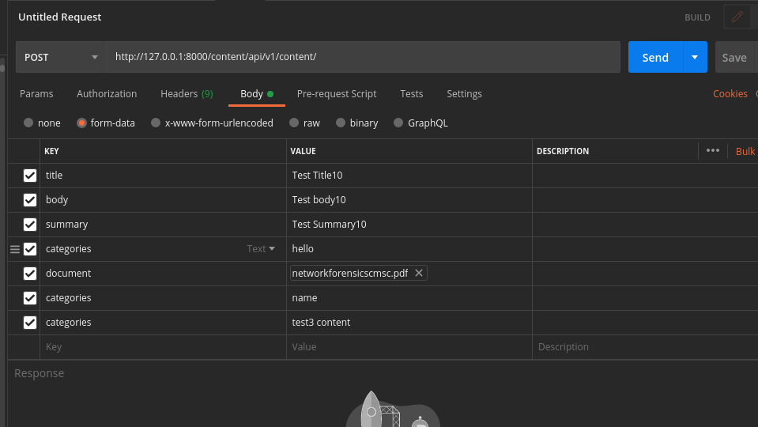

# DJANGO CMS


There are 2 types of user for content management.(Admin, Author)

  - Author can create, view, edit and delete only their contents
  - Admin can view, edit and delete any user's content

# Getting Started

  - Clone the project and change directory to cms
  > cd cms

  - You can create a virtualenv using(Python3.6 is expected to be installed)
  > virtualenv -p python3 env
  > source env/bin/activate

    OR

  - Directly install the python dependencies
  > pip install -r requirements.txt

  - Once, all the dependencies are installed we need to run a migration to create tables in database(sqlite3)
  > python manage.py makemigrations app_users
  > python manage.py makemigrations app_content
  > python manage.py migrate

  - To load admin user data with email -> admin@user.com and password -> 123
  > python manage.py loaddata fixtures/admin_populate.json

  - To run the application
  > python manage.py runserver

# Urls
  - Registration
  ```
  URL -> http://127.0.0.1:8000/overseers/api/v1/register/
  Method -> POST
  Payload -> {
        "email":"test3@user.com",
        "password":"8Pass123",
        "full_name": "FDFD DSJF",
        "phone": 3248948951,
        "pincode": 400025,
        "address": "jsaifdisdfd",
        "city": "mumbai",
        "state": "mah",
        "country": "ind"
    }
  ```

  - Login
  ```
  URL -> http://127.0.0.1:8000/overseers/api/v1/login/
  Method -> POST
  Payload -> {
    "email":"test3@user.com",
    "password":"8Pass123"
    }
  ```
  Response
  ```
  {
    "token": "6b983193e65583829b80f3c37f9939b0d57e849d",
    "status_code": 200
  }
  ```
  Store the token for next request and pass Token with Authorization headers as
  > Token 6b983193e65583829b80f3c37f9939b0d57e849d

  - Create Content(Strictly uses form-data and not json)
  ```
  URL -> http://127.0.0.1:8000/content/api/v1/content/
  Method -> POST
  ```
  

  - Get all Content
  ```
  URL -> http://127.0.0.1:8000/content/api/v1/content/
  Method -> GET
  ```

  - Get Content using id
  ```
  URL -> http://127.0.0.1:8000/content/api/v1/content/{content_id}/
  Method -> GET
  ```

  - Edit Content using id(Payload will be similar to Create Content, except not all fields are required)
  ```
  URL -> http://127.0.0.1:8000/content/api/v1/content/{content_id}/
  Method -> PUT
  ```

  - Delete Content using id
  ```
  URL -> http://127.0.0.1:8000/content/api/v1/content/{content_id}/
  Method -> DELETE
  ```

  - Search in content(Matches title, body, summary and categories)
  ```
  URL -> http://127.0.0.1:8000/content/api/v1/search/?q=test2 content
  Method -> GET
  ```
  **To switch between users simply login with that user, store the token in authorization header**
